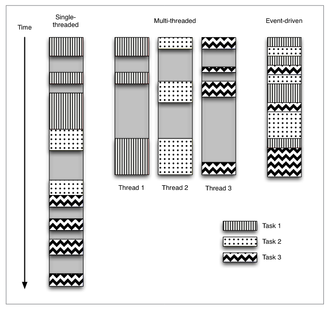

# Event-Driven Programming

Twisted is **event-driven networking engine** that means the program flow is determined by external events. It is characterized by an *event loop* and the use of callbacks to trigger actions when events happen. This structure different from *single-threaded (synchronous)* and *multithreaded programming*. An image below illustrate the comparison between them.

An image below showing the work done by a program over time. The program has three tasks to complete, each of which *blocks* while waiting foe I/O to finish. Time spent blocking on I/O is grayed out.

The event-driven version of the program interleaves the execution of the three tasks, but in a single thread of control. When performing I/O or other expensive operations, a callback is registered with an event loop, and then execution continous while the I/O completes. The callback describes how to handle an event once it has completed. The event loop polls for events and dispatches them as they arrive to the callbacks that are waiting for them. This allows the program to make progress without the use of additional threads.

The very stright forward explanation about event-driven model can be found at [here](https://www.youtube.com/watch?v=y4w8rkUHO5g).